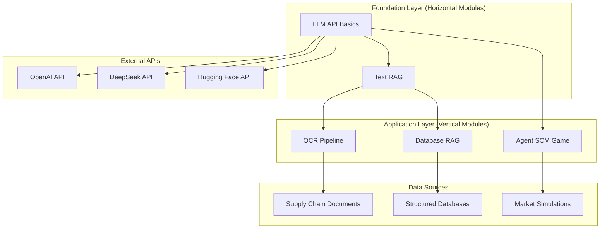

# Universal AI × Supply Chain Management (UAI × SCM)

[](https://choosealicense.com/licenses/mit/)
[](https://www.python.org/downloads/)
[](https://jupyter.org/)

> **Educational AI modules for Supply Chain Management applications, designed for MIT Learn and Open Learning platforms.**

## 🎯 Project Overview

This repository contains a comprehensive collection of Jupyter notebooks that demonstrate the practical application of Artificial Intelligence technologies in Supply Chain Management. Developed as part of the Universal AI initiative, these modules provide both foundational AI knowledge (horizontal modules) and specialized AI+X applications (vertical modules) targeting supply chain optimization, automation, and decision-making.

### 🌍 Target Audience
- **MIT Learn Students**: Structured learning path for AI in supply chain applications
- **Open Learning Community**: Global learners seeking practical AI implementation skills
- **Supply Chain Professionals**: Industry practitioners looking to integrate AI solutions
- **Researchers & Developers**: Those building AI-powered supply chain systems

## 📚 Table of Contents

- [Module Overview](#-module-overview)
- [Learning Path](#-learning-path)
- [Installation & Setup](#-installation--setup)
- [Module Descriptions](#-module-descriptions)
- [System Architecture](#-system-architecture)
- [Dependencies](#-dependencies)
- [Usage Examples](#-usage-examples)
- [Contributing](#-contributing)
- [License](#-license)

## 🧩 Module Overview

| Module | Type | Complexity | Focus Area | Key Technologies |
|--------|------|------------|------------|------------------|
| [LLM API Basics](#llm-api-basics) | Horizontal | Beginner | Foundation | OpenAI API, Function Calling |
| [Text RAG](#text-rag) | Horizontal | Intermediate | Information Retrieval | Sentence Transformers, Vector Search |
| [Database RAG](#database-rag) | Vertical | Intermediate | Structured Data | SQLite, Natural Language to SQL |
| [OCR Pipeline](#ocr-pipeline) | Vertical | Advanced | Document Processing | EasyOCR, PaddleOCR, Computer Vision |
| [Agent SCM Game](#agent-scm-game) | Vertical | Advanced | Decision Making | Multi-Agent Systems, Game Theory |

## 🛤️ Learning Path

### **Phase 1: Foundation (Horizontal Modules)**
1. **LLM API Basics** - Master Large Language Model integration
2. **Text RAG** - Learn Retrieval Augmented Generation fundamentals

### **Phase 2: Application (Vertical Modules)**
3. **Database RAG** - Apply RAG to structured supply chain data
4. **OCR Pipeline** - Digitize and process supply chain documents
5. **Agent SCM Game** - Build intelligent supply chain agents

## 🚀 Installation & Setup

### Prerequisites
- Python 3.8 or higher
- Jupyter Notebook or JupyterLab
- Git

### Quick Start
```bash
# Clone the repository
git clone https://github.com/your-org/uai-scm.git
cd uai-scm

# Install core dependencies
pip install -r requirements.txt

# Launch Jupyter
jupyter notebook
```

### API Keys Setup
Several modules require API keys. Create a `.env` file in the root directory:

```env
# Required for LLM API Basics and other modules
OPENAI_API_KEY=your_openai_api_key_here
DEEPSEEK_API_KEY=your_deepseek_api_key_here
HUGGINGFACE_API_KEY=your_huggingface_api_key_here
```

## 📖 Module Descriptions

### LLM API Basics
**File**: `LLM_API_Basics.ipynb`  
**Type**: Horizontal Module (Foundation)  
**Complexity**: Beginner  

A comprehensive introduction to Large Language Model APIs, covering essential concepts for AI integration in supply chain applications.

**Learning Objectives**:
- Master API authentication and key management
- Understand model parameters (temperature, top-p, max tokens)
- Implement caching strategies for cost optimization
- Build function calling capabilities
- Create robust error handling and security practices

**Key Features**:
- Multi-provider API support (OpenAI, Anthropic, DeepSeek)
- Token counting and context management
- Interactive examples with real supply chain scenarios
- Best practices for production deployment

**Use Cases**: Foundation for all other modules requiring LLM integration.

---

### Text RAG
**File**: `Text_RAG.ipynb`  
**Type**: Horizontal Module (Foundation)  
**Complexity**: Intermediate  

Learn to build Retrieval Augmented Generation systems for enhanced AI responses using document knowledge bases.

**Learning Objectives**:
- Understand vector embeddings and semantic search
- Implement document chunking and preprocessing
- Build similarity-based retrieval systems
- Create context-aware response generation
- Compare different LLM providers and approaches

**Key Features**:
- Sentence Transformers for embeddings
- Cosine similarity search with keyword boosting
- Multiple LLM backend support (DeepSeek, extractive methods)
- Interactive query interface
- Supply chain document examples (NovaTech Electronics case study)

**Use Cases**: Knowledge base querying, document Q&A, contextual information retrieval.

---

### Database RAG
**File**: `Database_RAG.ipynb`  
**Type**: Vertical Module (AI + Supply Chain)  
**Complexity**: Intermediate  

Advanced RAG implementation for structured supply chain databases, enabling natural language queries over complex relational data.

**Learning Objectives**:
- Convert natural language to SQL queries
- Implement hybrid retrieval (rule-based + LLM)
- Handle geopolitical supply chain data
- Build interactive database interfaces
- Optimize query performance and accuracy

**Key Features**:
- SQLite database with realistic supply chain schema
- Rule-based pattern matching for common queries
- LLM-powered SQL generation with multiple providers
- Geopolitical risk analysis capabilities
- Interactive UI for testing and validation

**Use Cases**: Supply chain analytics, inventory queries, supplier risk assessment, sales reporting.

---

### OCR Pipeline
**File**: `OCR.ipynb`  
**Type**: Vertical Module (AI + Supply Chain)  
**Complexity**: Advanced  

Build comprehensive OCR pipelines for digitizing handwritten and printed supply chain documents.

**Learning Objectives**:
- Implement multi-engine OCR systems
- Master image preprocessing techniques
- Structure extracted text using LLMs
- Handle real-world document variations
- Build interactive document processing interfaces

**Key Features**:
- Dual OCR engines (EasyOCR + PaddleOCR) for accuracy
- Advanced preprocessing (denoising, deskewing, contrast enhancement)
- JSON schema-driven text structuring
- LLM post-processing for data validation
- Interactive image upload and processing

**Use Cases**: Shipping manifest digitization, invoice processing, inventory documentation, compliance reporting.

---

### Agent SCM Game
**File**: `Agent_SCM_Game.ipynb`  
**Type**: Vertical Module (AI + Supply Chain)  
**Complexity**: Advanced  

Develop intelligent agents for supply chain decision-making through competitive game environments.

**Learning Objectives**:
- Design multi-agent supply chain systems
- Implement AI decision-making algorithms
- Build competitive learning environments
- Analyze agent performance and strategies
- Create adaptive difficulty systems

**Key Features**:
- OpenAI function calling for agent decisions
- Dynamic market simulation with realistic constraints
- Human vs. AI competitive gameplay
- Comprehensive evaluation framework
- Adaptive difficulty based on performance
- Detailed analytics and visualization

**Use Cases**: Supply chain optimization, inventory management training, decision support systems, strategic planning.

## 🏗️ System Architecture



## 📦 Dependencies

### Core Requirements
```
jupyter>=1.0.0
numpy>=1.21.0
pandas>=1.3.0
requests>=2.25.0
python-dotenv>=0.19.0
```

### AI/ML Libraries
```
openai>=1.0.0
sentence-transformers>=2.2.0
scikit-learn>=1.0.0
torch>=1.11.0
transformers>=4.21.0
```

### Computer Vision (OCR Module)
```
opencv-python>=4.5.0
easyocr>=1.6.0
paddleocr>=2.6.0
pillow>=8.3.0
matplotlib>=3.5.0
```

### Interactive Components
```
ipywidgets>=7.6.0
plotly>=5.0.0
```

### Database
```
sqlite3 (built-in)
```

## 💡 Usage Examples

### Quick Start with LLM API Basics
```python
from openai import OpenAI
import os

# Initialize client
client = OpenAI(api_key=os.getenv("OPENAI_API_KEY"))

# Basic completion
response = client.chat.completions.create(
    model="gpt-4",
    messages=[{"role": "user", "content": "Explain supply chain optimization"}]
)
print(response.choices[0].message.content)
```

### RAG Query Example
```python
# Load the Text RAG system
question = "What are the main supply chain bottlenecks for NovaTech?"
answer = rag_answer(question, model="deepseek")
print(answer)
```

### Database Query Example
```python
# Natural language to SQL
question = "Show me sales by supplier for Q1"
result = db_rag_pipeline(question, conn, sql_method="combined")
print(result['answer'])
```

## 🤝 Contributing

We welcome contributions from the community! Please see our [Contributing Guidelines](CONTRIBUTING.md) for details on:

- Code style and standards
- Testing requirements
- Pull request process
- Issue reporting

### Development Setup
```bash
# Fork and clone the repository
git clone https://github.com/your-username/uai-scm.git
cd uai-scm

# Create development environment
python -m venv venv
source venv/bin/activate  # On Windows: venv\Scripts\activate

# Install development dependencies
pip install -r requirements-dev.txt

# Run tests
pytest tests/
```

## 📄 License

This project is licensed under the MIT License - see the [LICENSE](LICENSE) file for details.

## 🙏 Acknowledgments

- **MIT Open Learning**: For providing the educational framework
- **Universal AI Initiative**: For the modular AI education approach
- **Supply Chain Community**: For real-world use cases and feedback
- **Open Source Contributors**: For the underlying technologies and libraries

---

**Built with ❤️ for the global learning community**
